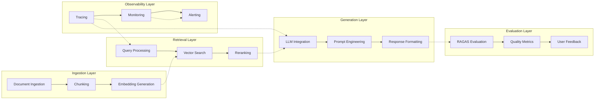

# Component Architecture

## Layer Descriptions

### Ingestion Layer
Handles document processing and preparation for retrieval
- **Document Ingestion**: PDF, web, and other data sources
- **Chunking**: Strategic document segmentation
- **Embedding Generation**: Vector representation creation

### Retrieval Layer
Manages query processing and context retrieval
- **Query Processing**: Query optimization and expansion
- **Vector Search**: Semantic similarity retrieval
- **Reranking**: Result refinement and optimization

### Generation Layer
Produces final responses with proper context
- **LLM Integration**: Model integration and management
- **Prompt Engineering**: Context injection and optimization
- **Response Formatting**: Citation and structure handling

### Evaluation Layer
Ensures system quality and reliability
- **RAGAS Evaluation**: Automated quality assessment
- **Quality Metrics**: Performance tracking
- **User Feedback**: Continuous improvement data

### Observability Layer
Provides visibility into system operation
- **Tracing**: Request flow tracking
- **Monitoring**: Performance and health metrics
- **Alerting**: Issue detection and notification
