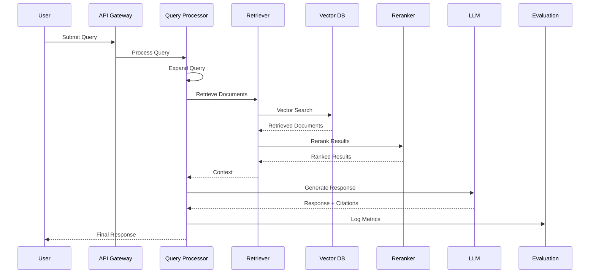

# Data Flow Diagram

## Flow Stages

### 1. Query Submission
- User submits natural language query
- API gateway validates and authenticates
- Request is routed to processing layer

### 2. Query Processing
- Query preprocessing and normalization
- Query expansion with synonyms and related terms
- Multi-query generation for better coverage

### 3. Retrieval
- Vector search in embedding database
- Hybrid search combining semantic and keyword
- Metadata filtering for domain-specific results

### 4. Reranking
- Cross-encoder reranking for precision
- Context compression for efficiency
- Relevance scoring optimization

### 5. Generation
- Context injection into LLM prompt
- Response generation with citations
- Quality checks and validation

### 6. Evaluation
- Log all metrics and telemetry
- Track performance indicators
- Collect user feedback
