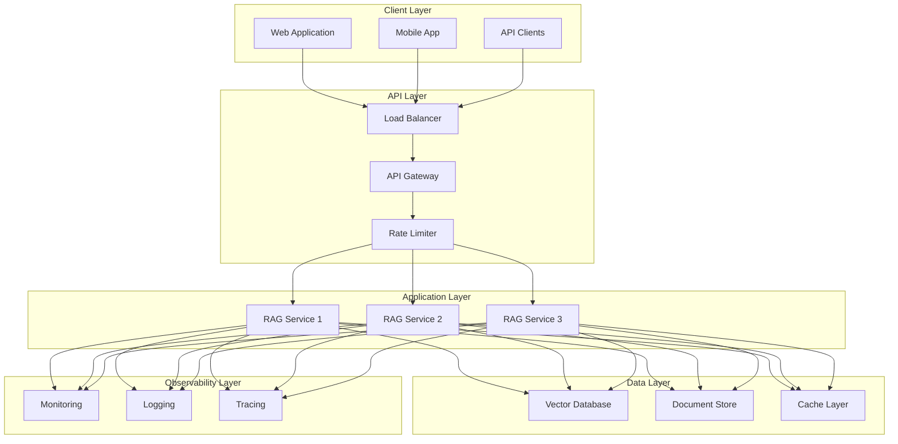

# Deployment Architecture

## Deployment Components

### Client Layer
- **Web Application**: Browser-based interface
- **Mobile App**: Native mobile applications
- **API Clients**: Third-party integrations

### API Layer
- **Load Balancer**: Distributes traffic across instances
- **API Gateway**: Request routing and authentication
- **Rate Limiter**: Prevents abuse and ensures fair usage

### Application Layer
- **RAG Services**: Multiple instances for scalability
- **Auto-scaling**: Dynamic resource allocation
- **Container Orchestration**: Kubernetes for management

### Data Layer
- **Vector Database**: Pinecone/Weaviate for embeddings
- **Document Store**: PostgreSQL/MongoDB for documents
- **Cache Layer**: Redis for frequently accessed data

### Observability Layer
- **Monitoring**: Prometheus/Grafana for metrics
- **Logging**: ELK stack for log aggregation
- **Tracing**: Jaeger/Zipkin for distributed tracing

## Scalability Features

- **Horizontal Scaling**: Add more RAG service instances
- **Vertical Scaling**: Increase instance resources
- **Caching**: Reduce database load
- **Load Balancing**: Distribute traffic efficiently
- **Auto-scaling**: Adjust resources based on demand
