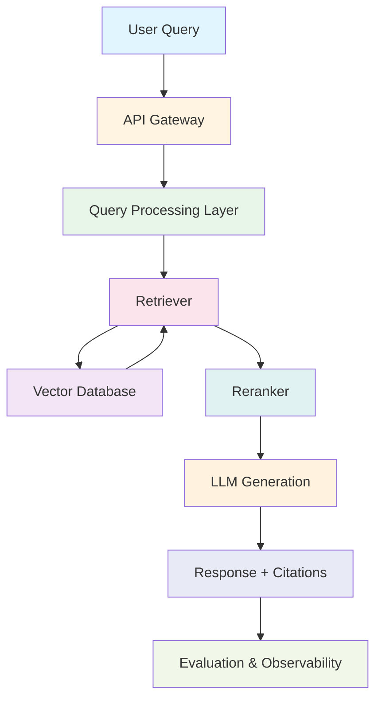

# High-Level Architecture Diagram

## Components

### API Gateway
- Entry point for all requests
- Authentication and authorization
- Rate limiting
- Request routing

### Query Processing Layer
- Query preprocessing
- Query expansion
- Query transformation
- Multi-query generation

### Retriever
- Vector search
- Hybrid search
- Metadata filtering
- Multi-query retrieval

### Vector Database
- FAISS / Pinecone / Weaviate
- Embedding storage
- Semantic search
- Scalable retrieval

### Reranker
- Cross-encoder reranking
- Context compression
- Relevance scoring
- Result optimization

### LLM Generation
- Context injection
- Prompt engineering
- Response generation
- Citation extraction

### Evaluation & Observability
- Quality metrics
- Performance monitoring
- User feedback
- Continuous evaluation
